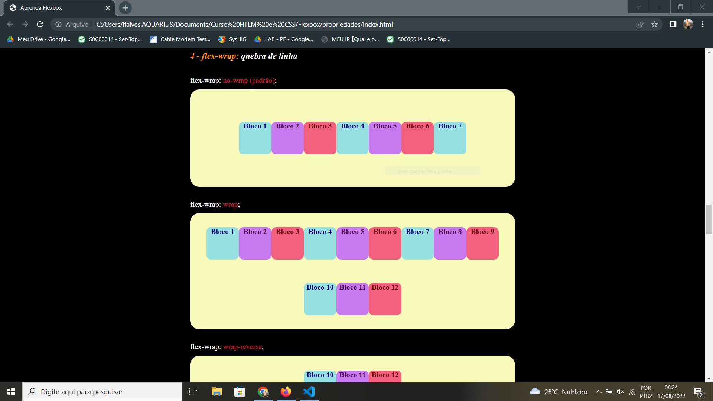

# Flexbox

Site desenvolvido para ensinar sobre o display flex, mostrando o comportamento de cada propriedade.

 

Acessar site: <a href="http://lfalvespe.github.io/flexbox">http://lfalvespe.github.io/flexbox</a>

